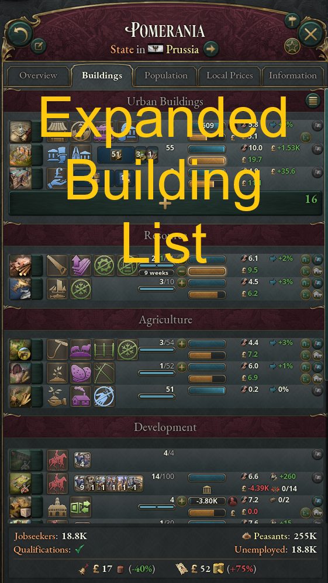

Expands the Buildings list on the State panel so more actions and information are available without opening the Building Details panel.

*Mod written for Victoria 3 patch 1.9.8*

## Modifications

*UI-only — no gameplay changes.*

- List mode is now the default Building view. If you're using this mod, you're using it for list mode!
- Fixed a bug from vanilla where Buildings would sometimes appear multiple times in list mode.

### Additions
- Production Method buttons for all Buildings in the State.
- Property portfolio for Manor Houses, Financial Districts, etc.
- Combat unit summary for Military Buildings
- Building Ownership bar to see owned levels
- Construction progress bar
- Employment bar, with number of missing employees
- Employment status indicator and hiring reason
- Average Wage
- Throughput bonus for most Buildings
- Show other useful information: Mobilized Battallions, Trade Capacity, etc.
- Autoexpand, Subsidize, Nationalize, and Privatize buttons all available on screen

## Links

- [View on Steam](https://steamcommunity.com/sharedfiles/filedetails/?id=3554155131)

## Acknowledgements

- Originally inspired by [Essential UI](https://steamcommunity.com/sharedfiles/filedetails/?id=3019598652) by [6ap6apblckaAa](https://steamcommunity.com/id/6ap6apblckaAa)
    - Code for including the PM buttons
    - Employment reason indicator icons
    - Wage icon
    - Just showing me where and how to muck around with the UI code to show what I wanted
- The [modding information on the Victoria 3 Wiki](https://vic3.paradoxwikis.com/Modding)
- Lots of information floating around [Victoria 3 Mod Co-Op discord](https://discord.gg/XJbqFbHdsM)
